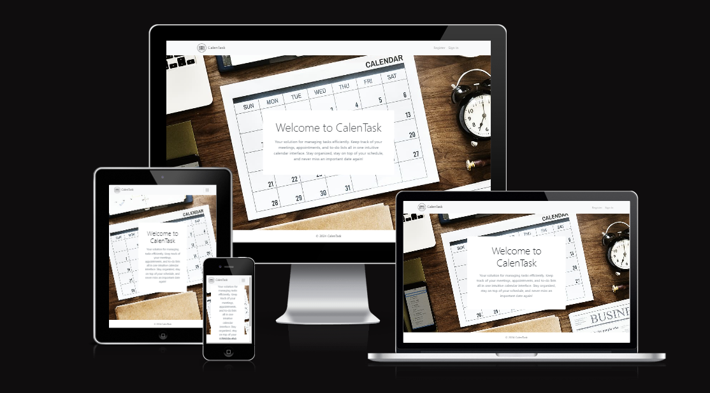
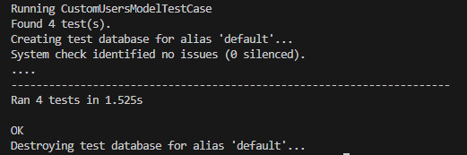

# CalenTask

## Table of Contents

- [Authentication App](#authentication-app)
  - [Models](#models)
    - [CustomUsers](#customusers)
    - [CustomUserManager](#customusermanager)
  - [Endpoints](#endpoints)
- [API App](#api-app)
  - [Models](#models-1)
    - [Category](#category)
    - [Task](#task)
    - [TaskAssigned](#taskassigned)
    - [Log](#log)
  - [Endpoints](#endpoints-1)
- [Installation](#installation)
- [Tests](#tests)
  - [CustomUsersModelTestCase](#customusersmodeltestcase)
  - [CategoryModelTestCase](#categorymodeltestcase)
  - [TaskModelTestCase](#taskmodeltestcase)
  - [TaskAssignedModelTestCase](#taskassignedmodeltestcase)
  - [LogModelTestCase](#logmodeltestcase)
- [Deployment](#deployment)

## Introduction and Project Goals

CalenTask is a Task Management System designed to help users organize and track their tasks efficiently. It allows users to register, create tasks, assign them to other users, and monitor their progress through an intuitive calendar interface.

## Authentication App

### Models

#### CustomUsers

- `name`: CharField(max_length=256, null=True, blank=True)
- `email`: EmailField(max_length=256, unique=True)
- `username`: CharField(max_length=256, null=True, blank=True)
- `password`: CharField(max_length=2048)
- `timestamp`: DateTimeField(auto_now_add=True)

#### CustomUserManager

- Provides custom methods for creating regular users and superusers.

### Endpoints

- `validate`: POST - Validate user credentials.
- `users`: GET - Retrieve a list of users.
- `user`: GET/POST - Retrieve or create a user.
- `user/<pk>`: GET/PUT/DELETE - Retrieve, update, or delete a specific user.

## API App

### Models

#### Category

- `name`: CharField(max_length=50, unique=True)

#### Task

- `title`: CharField(max_length=256)
- `priority`: CharField(max_length=10, choices=[("Important", "Important"), ("Medium", "Medium"), ("Low", "Low")], default="Medium")
- `category`: ForeignKey(Category, on_delete=models.CASCADE)
- `progress`: CharField(max_length=11, choices=[("Open", "Open"), ("In Progress", "In Progress"), ("Done", "Done")], default="Open")
- `startDate`: DateField(default=timezone.now)
- `endDate`: DateField()
- `attachment`: FileField(null=True, blank=True, upload_to="static/attachments/")
- `description`: TextField(blank=True, null=True)
- `timestamp`: DateTimeField(default=timezone.now)

#### TaskAssigned

- `task`: ForeignKey(Task, on_delete=models.CASCADE)
- `user`: ForeignKey(CustomUsers, on_delete=models.CASCADE)
- `isOwner`: BooleanField(default=False)
- `timestamp`: DateTimeField(default=timezone.now)

#### Log

- `type`: CharField(max_length=10, default="")
- `task`: ForeignKey(Task, on_delete=models.CASCADE, blank=True, null=True)
- `user`: ForeignKey(CustomUsers, on_delete=models.CASCADE, blank=True, null=True)
- `timestamp`: DateTimeField(default=timezone.now)

### Endpoints

- `categories`: GET - Retrieve a list of categories.
- `tasks`: GET/POST - Retrieve a list of tasks or create a new task.
- `tasks/<pk>`: GET/PUT/DELETE - Retrieve, update, or delete a specific task.
- `task_assigned`: GET/POST - Retrieve a list of task assignments or create a new assignment.
- `task_assigned/<pk>`: GET/PUT/DELETE - Retrieve, update, or delete a specific assignment.
- `log_entries`: GET/POST - Retrieve a list of log entries or create a new entry.
- `log_entries/<pk>`: GET/PUT/DELETE - Retrieve, update, or delete a specific log entry.

## Installation

1. Clone the repository.
2. Install dependencies: `pip install -r requirements.txt`.
3. Make migrations: `python manage.py makemigrations`.
4. Run migrations: `python manage.py migrate`.
5. Start the development server: `python manage.py runserver`.

## Tests

The tests in this section are written using Django's `TestCase` class. They cover the models in the authentication and API apps.

### CustomUsersModelTestCase

- Screenshot: 

This test case verifies the functionality of the `CustomUsers` model in the authentication app. It includes the following test methods:

- `test_create_user`: Tests the creation of a user and checks if the email and string representation are set correctly.
- `test_unique_email`: Tests that creating a user with an existing email raises an exception.
- `test_authentication`: Tests if a user with a specific email exists in the database.
- `test_authorization`: Tests if a user can be set as staff and superuser.

### CategoryModelTestCase

- Screenshot: 

This test case verifies the functionality of the `Category` model in the API app. It includes the following test method:

- `test_category_creation`: Tests the creation of a category and checks if the name is set correctly.

### TaskModelTestCase

- Screenshot: 

This test case verifies the functionality of the `Task` model in the API app. It includes the following test method:

- `test_task_creation`: Tests the creation of a task and checks if the title, priority, category, and progress are set correctly.

### TaskAssignedModelTestCase

- Screenshot: 

This test case verifies the functionality of the `TaskAssigned` model in the API app. It includes the following test method:

- `test_task_assigned_creation`: Tests the creation of a task assignment and checks if the task, user, and isOwner flag are set correctly.

### LogModelTestCase

- Screenshot: 

This test case verifies the functionality of the `Log` model in the API app. It includes the following test method:

- `test_log_creation`: Tests the creation of a log entry and checks if the type, task, and user are set correctly.

## Deployment

CalenTask is deployed on Heroku using Heroku PostgreSQL as the database. By default, CalenTask uses SQLite3 as the database during development.

1. Create a Heroku account and install the Heroku CLI.
2. Log in to Heroku CLI (`heroku login`) and create a new Heroku app (`heroku create`).
3. Set up Heroku PostgreSQL as the database (`heroku addons:create heroku-postgresql`).
4. Push your code to the Heroku remote (`git push heroku master`).
5. Run migrations and set up the database (`heroku run python manage.py migrate`).
6. Your CalenTask application should now be deployed and accessible via the provided Heroku app URL.
7. Your app should now be deployed and accessible via the provided Heroku URL.
